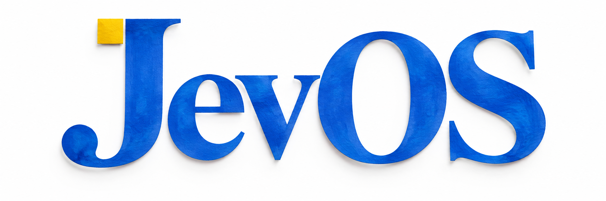

<div align="center">

🇺🇸 <a href="README.md">English</a> | 🇨🇳 <a href="README.zh.md">中文</a>

<h1>JevOS</h1>




</div>

## 引言

JevOS 是可安装的网页桌面。Jev 判断任务所需工具和布局，独立语言模型生成可保存的微应用。本地交互保留笔记和应用状态。生成应用在受限 iframe 中运行；消息与会议为演示，不向外发送。

本仓库保留与现有 9 月 27 日 v2 macOS 安装包对应的最小运行源码。后续音乐、消息、终端模拟和路演材料不在这一版本内。不宣称已实现通用递归应用生成加速，也不宣称完整三分钟彩排已通过。

## 运行

使用 Node 22.x 中的 22.12+ 版本，或 Node 24+，以及 npm 10+。

```sh
npm ci
cp .env.example .env.local
npm run dev
```

打开 `http://localhost:5173`。填写 `TYPESAFE_API_KEY` 启用 Jev，填写 `APP_GENERATOR_API_KEY`、`APP_GENERATOR_MODEL` 启用应用生成。可用 `APP_GENERATOR_BASE_URL` 指定兼容接口。密钥保存在本地服务端；缺少配置时，界面提示相应模型功能不可用。

```sh
npm run build
PORT=4273 npm run preview
```

本地数据库位于 `.data/`，不会进入 Git。

## macOS 下载

在[发布页面](https://github.com/JunkaiWang-TheoPhy/JevOS/releases)下载现有 v2 DMG。先退出正在运行的 JevOS，再将新版拖入 Applications。安装包适用于 Apple Silicon、macOS 13+，采用临时签名，尚未 Apple 公证。本次上传没有重新打包。

发布附件包含 SHA-256、文件清单及完整对应源码。最小仓库省略研究笔记、开发测试和生成产物。原生宿主源码位于 `packaging/macos/JevOS.swift`；完整源码附件保留原构建工具。

## 许可与联系

应用代码采用 [AGPL-3.0](LICENSE)。依赖、字体和其他素材保留上游许可，见 [THIRD_PARTY.md](THIRD_PARTY.md) 与 `public/brand/fonts/` 中的许可文件。

[WangTheoPhys@outlook.com](mailto:WangTheoPhys@outlook.com) · [个人网站](https://Junkaiwang-theophy.github.io)
